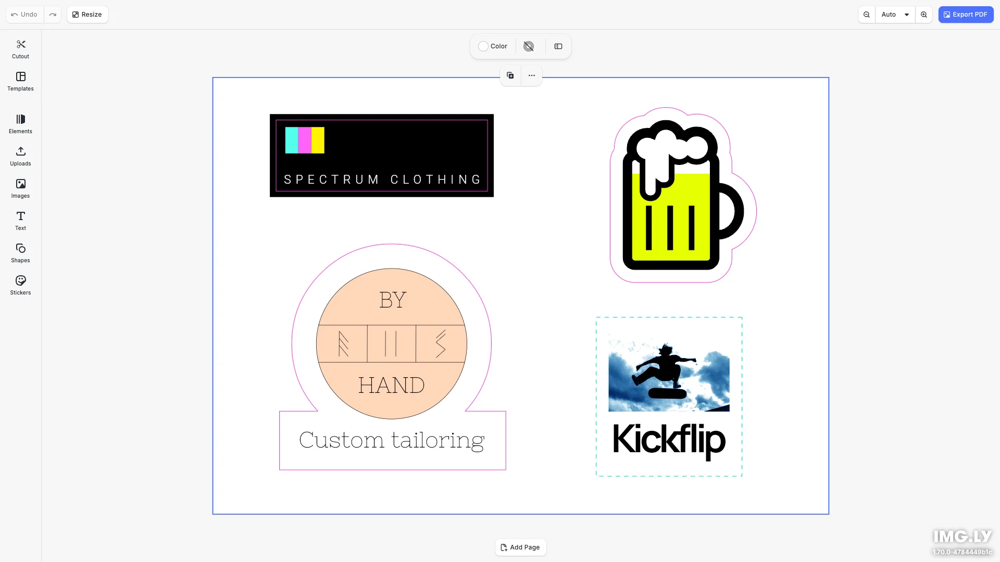

# Cutout Lines Editor Starter Kit

Create print-ready designs with die-cut lines. Select any shape to create cutout lines for stickers, labels, and packaging. Built with [CE.SDK](https://img.ly/creative-sdk) by [IMG.LY](https://img.ly), runs entirely in the browser with no server dependencies.

<p>
  <a href="https://img.ly/docs/cesdk/js/plugins/cutout-library/">Documentation</a> |
  <a href="https://img.ly/showcases/cesdk">Live Demo</a>
</p>



## Features

- **Cutout Line Creation** - Create die-cut lines from shapes with one click:
  - **Canvas Menu**: Right-click on a shape and select "Create Cutout"
  - **Cutout Panel**: Click the "Cutout" button in the dock to access saved cutouts
- **Text Editing** - Typography with fonts, styles, and effects
- **Image Placement** - Add, crop, and arrange images
- **Shapes & Graphics** - Vector shapes and design elements
- **Export** - PDF with print-ready cutout lines

## Getting Started

### Clone the Repository

```bash
git clone https://github.com/imgly/starterkit-cutout-lines-editor-ts-web.git
cd starterkit-cutout-lines-editor-ts-web
```

### Install Dependencies

```bash
npm install
```

### Download Assets

CE.SDK requires engine assets (fonts, icons, UI elements) served from your `public/` directory.

```bash
curl -O https://cdn.img.ly/packages/imgly/cesdk-js/$UBQ_VERSION$/imgly-assets.zip
unzip imgly-assets.zip -d public/
rm imgly-assets.zip
```

### Run the Development Server

```bash
npm run dev
```

Open `http://localhost:5173` in your browser.

## Usage

### Via Canvas Menu
1. Select a shape in the editor
2. Right-click to open the canvas menu
3. Click "Create Cutout" to generate die-cut lines

### Via Cutout Panel
1. Click the "Cutout" button in the dock (left sidebar)
2. The Cutout panel will open showing saved cutouts
3. Click on a cutout to apply it to your design

## Architecture

```
src/
├── imgly/
│   ├── config/
│   │   ├── actions.ts                # Export/import actions
│   │   ├── features.ts               # Feature toggles
│   │   ├── i18n.ts                   # Translations
│   │   ├── plugin.ts                 # Main configuration plugin
│   │   ├── settings.ts               # Engine settings
│   │   └── ui/
│   │       ├── canvas.ts                 # Canvas configuration
│   │       ├── components.ts             # Custom component registration
│   │       ├── dock.ts                   # Dock layout configuration
│   │       ├── index.ts                  # Combines UI customization exports
│   │       ├── inspectorBar.ts           # Inspector bar layout
│   │       ├── navigationBar.ts          # Navigation bar layout
│   │       └── panel.ts                  # Panel configuration
│   ├── index.ts                  # Editor initialization function
│   └── plugins/
│       └── cutout-library.ts
└── index.ts
```

## Prerequisites

- **Node.js v20+** with npm - [Download](https://nodejs.org/)
- **Supported browsers** - Chrome 114+, Edge 114+, Firefox 115+, Safari 15.6+

## Troubleshooting

| Issue | Solution |
|-------|----------|
| Editor doesn't load | Verify assets are accessible at `baseURL` |
| Assets don't appear | Check `public/assets/` directory exists |
| Watermark appears | Add your license key |
| Cutout menu not appearing | Ensure a shape is selected, not an image |

## Documentation

For complete integration guides and API reference, visit the [Cutout Library Plugin Documentation](https://img.ly/docs/cesdk/js/plugins/cutout-library/).

## License

This project is licensed under the MIT License - see the [LICENSE](LICENSE) file for details.

---

<p align="center">Built with <a href="https://img.ly/creative-sdk?utm_source=github&utm_medium=project&utm_campaign=starterkit-cutout-lines-editor">CE.SDK</a> by <a href="https://img.ly?utm_source=github&utm_medium=project&utm_campaign=starterkit-cutout-lines-editor">IMG.LY</a></p>
